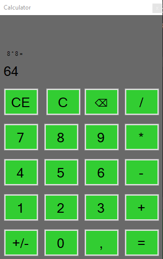

  <h1>Calculator 🧮</h1>
  <h3><i>Ещё один калькулятор... но хотя бы рабочий</i></h3>
  
<b>Сделан на C#, кофеине и вере в простоту.</b>

---

## ⚙️ О проекте
**Calculator** — классический настольный калькулятор на **C# (WinForms)**.  
Да, ещё один из миллиардов калькуляторов на GitHub —  
но этот хотя бы не падает при делении на ноль… (почти).

---

## 🧩 Возможности
- ➕ **Базовые операции:** сложение, вычитание, умножение, деление.  
- 🧠 **Память и очистка:** работают стабильно, что уже достижение.  
- 👨🏼‍💻 **Минималистичный интерфейс:** ничего лишнего — только кнопки и цифры.  

> ⚡ *Подходит тем, кто хочет считать быстрее, чем компилируется проект.*

---

## 📸 Скриншот

  
  
Просто и со вкусом. Как и должно быть.

---

## 👨‍💻 Автор
Создано **Wixon Shade** —  
тем самым человеком, который решил, что миру нужен ещё один калькулятор.

---

## ☕ Поддержка проекта
Хочешь поддержать развитие бессмысленно-полезных приложений?  
Можно задонатить сюда → [💰 Donation Alerts](https://dalink.to/w1xon)  

> Каждая кружка кофе снижает количество багов (в теории).

---

  © 2025 Wixon Shade — Сделано с 🖤 и переизбытком кофеина. 
  

